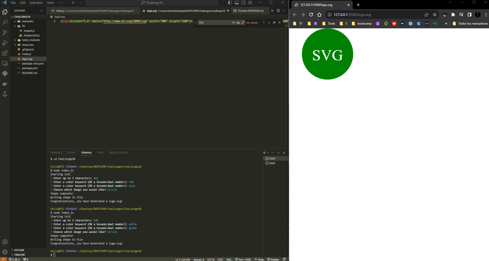

# SVG LOGO MAKER

  
## Description:
The application allows users to input data into an Inquirer prompt to generate a "logo.svg" file that represents the user's desired outcomes as an SVG image.

## Table of Contents:
- [SVG LOGO MAKER](#svg-logo-maker)
  - [Description:](#description)
  - [Table of Contents:](#table-of-contents)
  - [The Challenge:](#the-challenge)
  - [Acceptance Criteria](#acceptance-criteria)
  - [Video:](#video)
  - [Screenshot:](#screenshot)

## The Challenge:
Build a Node.js command-line application that takes in user inputs to generates a SVG logo and saves it as "logo.svg" file. In addition, create a walkthrough video that demonstrates its functionality and the passing of all of the tests.

## Acceptance Criteria
GIVEN a command-line application that accepts user input
WHEN I am prompted for text
THEN I can enter up to three characters
WHEN I am prompted for the text color
THEN I can enter a color keyword (OR a hexadecimal number)
WHEN I am prompted for a shape
THEN I am presented with a list of shapes to choose from: circle, triangle, and square
WHEN I am prompted for the shape's color
THEN I can enter a color keyword (OR a hexadecimal number)
WHEN I have entered input for all the prompts
THEN an SVG file is created named `logo.svg`
AND the output text "Generated logo.svg" is printed in the command line
WHEN I open the `logo.svg` file in a browser
THEN I am shown a 300x200 pixel image that matches the criteria I entered

## Video:
[Click Here to Watch](./resources/video/shapes.js%20-%20Challenge10%20-%20Visual%20Studio%20Code%202023-10-15%2014-21-31.mp4)

## Screenshot:

